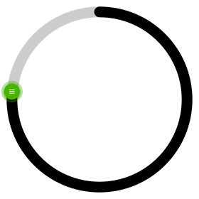

<a id="readme-top"></a>

[![Version][version-shield]][version-url]
[![Package-Size][package-size-shield]][package-size-url]
[![Stargazers][stars-shield]][stars-url]
[![Contributors][contributors-shield]][contributors-url]
[![Forks][forks-shield]][forks-url]
[![project_license][license-shield]][license-url]

[![Watsonised][watsonised-logo]][watsonised-url]
[![LinkedIn][linkedin-shield]][linkedin-url]


<!-- PROJECT LOGO -->
<br />
<div align="center">
  <a href="https://github.com/mark33mark/circular-slider_react">
    
  </a>

<h3 align="center">A Circular Sliding Input Component ⇶ for React projects</h3>

  <p align="center">
    A highly customisable circular slider with <strong>zero dependencies</strong> 
  </p>
  
    
  <a href=https://circular-slider-react.watsonised.me><strong>◻ live demo</strong></a>  
  <a href=https://sb-circular-slider-react.watsonised.me><strong>◻ storybook</strong></a>
    
  
  <h3>Explore the docs »»»</h3>
  <p>
    &middot;
    <a href="https://github.com/Mark33Mark/circular-slider_react"> View Demo </a>
    &middot;
    <a href="https://github.com/Mark33Mark/circular-slider_react/issues/new?labels=bug&template=bug-report---.md"> Report Bug </a>
    &middot;
    <a href="https://github.com/Mark33Mark/circular-slider_react/issues/new?labels=enhancement&template=feature-request---.md"> Request Feature </a>
    &middot;
  </p>
</div>


<!-- TABLE OF CONTENTS -->
<details open>
  <summary><strong><u>Table of Contents</u></strong></summary>
  <ol>
    <li>
      <a href="#about-the-project">About The Project</a>
      <ul>
        <li><a href="#built-with">Built with</a></li>
        <li><a href="#project-structure">Project structure</a></li>
      </ul>
    </li>
    <li>
      <a href="#getting-started">Getting Started</a>
      <ul>
        <li><a href="#use-in-your-react-project">Use in your React project</a></li>
        <li><a href="#get-a-copy-of-the-code-to-contribute">Get a copy of the code</a></li>
      </ul>
    </li>
    <li><a href="#usage">Usage</a></li>
      <ul>
        <li><a href="#default---no-customising">Default</a></li>
        <li><a href="#props">Props</a></li>
        <li><a href="#custom-configuration">Custom</a></li>
        <li><a href="#arc">Arc</a></li>
      </ul>
    <li><a href="#roadmap">Roadmap</a></li>
    <li><a href="#contributing">Contributing</a></li>
    <li><a href="#license">License</a></li>
    <li><a href="#contact">Contact</a></li>
    <li><a href="#acknowledgments">Acknowledgments</a></li>
    <li><a href="#goodwill">Goodwill</a></li>
  </ol>
</details>


<!-- ABOUT THE PROJECT -->
## About The Project
[![arc circular slider][circular-slider-arc]](https://circular-slider-react.watsonised.me)


### Built with

[![javascript][javascript]][javascript-url] [![node][nodejs]][nodejs-url] [![npm][npm]][npm-url] [![react][react.js]][react-url]  [![storybook][storybook]][storybook-url] [![sqlite][sqlite]][sqlite-url]


<p align="right">(<a href="#readme-top">back to top</a>)</p>


### Project structure

Set up as a mono-repo using NPM's `workpaces` 

```sh
  .../circular-slider_react
            .
            |-- LICENSE
            |-- README.md
            |
            |-- package.json
            |-- packages
                |-- circular-slider-lib
                |   |-- _stories
                |   |   |
                |   |   `-- components
                |   |
                |   |-- package.json
                |   |-- src
                |   |   |-- components
                |   |   |-- hooks
                |   |   |-- index.js
                |   |   |-- redux
                |   |   |-- styles
                |   |   `-- utilities
                |   |-- vite.config.js
                |   `-- vitest.config.js
                |
                `-- demo-app
                    |-- index.html
                    |-- package.json
                    |-- public
                    |   |-- data
                    |   |-- robots.txt
                    |   |-- sql-wasm.wasm
                    |   `-- sqlite.worker.js
                    |-- src
                    |   |-- assets
                    |   |-- components
                    |   |-- hooks
                    |   `-- styling
                    `-- vite.config.js

```

<p align="right">(<a href="#readme-top">back to top</a>)</p>


<!-- GETTING STARTED -->
## Getting Started

Designed to be imported into your React project and consumed as a component in your application.  Refer to the [demonstration][demonstration-url] or [storybook][storybook-url], in particular you can interact with the available properties  for the circular-slider component to get a greater understanding of what is possible with this project.

### Use in your React project

To use this component in your project, install the package, my example uses NPM:

  ```sh
  npm install @watsonised/circular-slider-for-react
  ```

### Get a copy of the code to contribute

1. Clone the repo
   ```sh
   git clone https://github.com/Mark33Mark/circular-slider_react.git
   ```
2. Install NPM packages
   ```sh
   npm i
   ```
3. Change git remote url to avoid accidental pushes to base project
   ```sh
   git remote set-url origin Mark33Mark/circular-slider_react
   
   # confirm the changes
   git remote -v 
   ```

<p align="right">(<a href="#readme-top">back to top</a>)</p>


<!-- USAGE EXAMPLES -->
## Usage

### Default - no customising

```jsx

  import { CircularSlider } from '@watsonised/circular-slider-for-react';

  export const App = () => (
      <>
          <CircularSlider onChange={ value => console.log(value) } />
      </>
  );

```

<p align="right">(<a href="#readme-top">back to top</a>)</p>

### Props

| Prop                      | Type                                                    | Default                                   | Description                                                                                               |
|---------------------------|---------------------------------------------------------|-------------------------------------------|-----------------------------------------------------------------------------------------------------------|
| `arcEnd`                  | `number`                                                | `undefined`                               | End angle (in degrees) for arc mode. Use with `arcStart` (e.g. `135` for lower-right = 270° speedometer sweep). |
| `arcStart`                | `number`                                                | `undefined`                               | Start angle (in degrees) for arc mode. Use with `arcEnd` to create a partial-circle gauge (e.g. `225` for lower-left). |
| `data`                    | `(string \| number)[]`                                  | `[]`                                      | Array of values or labels, evenly spread over 360°. If not provided, a data array of 0 t0 360 generated.  |
| `dataIndex`               | `number`                                                | `0`                                       | Initial index position in the data array.                                                                 |
| `direction`               | `string`                                                | `clockwise`                               | Rotation direction set with: `clockwise` or `anticlockwise`.                                              |
| `isDragging`              | `boolean`                                               | `() => {}`                                | Callback to signal whether the slider is being dragged.                                                   |
| `keypressStep`            | `integer`                                               | `1`                                       | For keyboard. When set to `1` the slider will progress `1` data point with `1` keypress.                  |
| `knobAnimated`            | `boolean`                                               | `true`                                    | If `true`, the knob outer ring will show a pulse animation.                                               |
| `knobColor`               | `string`                                                | `"#48B400"`                             | Color of the knob.                                                                                        |
| `knobDraggable`           | `boolean`                                               | `true`                                    | If `true`, the knob is draggable.                                                                         |
| `knobHide`                | `boolean`                                               | `false`                                   | If `true`, the knob is hidden.                                                                            |
| `knobHideRing`            | `boolean`                                               | `false`                                   | If `true`, the translucent ring around the knob is hidden.                                                |
| `knobPosition`            | `string \| number`                                      | `"top"`                                   | Starting position: accepts `"top"`, `"right"`, `"bottom"`, `"left"` or an angle (in degrees).             |
| `knobRingRadius`          | `floating point number`                                 | `0.45`                                    | Access to set how visible the outer ring of the knob.                                                     |
| `knobSize`                | `number`                                                | `36`                                      | Diameter of the knob in pixels.                                                                           |
| `label`                   | `string`                                                | `"ANGLE"`                                 | Text label displayed on the slider.                                                                       |
| `labelAppendCss`          | `string`                                                | `undefined`                               | Directly set CSS to set the style / position to your requirement.                                         |
| `labelAppendValue`        | `string`                                                | `""`                                      | Text appended to the value.                                                                               |
| `labelBottom`             | `boolean`                                               | `false`                                   | If `true`, the label is positioned below the slider.                                                      |
| `labelColor`              | `string`                                                | `"#333"`                                | Color of the label and value text.                                                                        |
| `labelFontSize`           | `string`                                                | `"1rem"`                                  | Font size of the label.                                                                                   |
| `labelHideValue`          | `boolean`                                               | `false`                                   | If `true`, both the label and value are hidden.                                                           |
| `labelHorizontalOffset`   | `string`                                                | `undefined`                               | Horizontal offset for the label / value display.                                                          |
| `labelPrependCss`         | `string`                                                | `undefined`                               | Directly set CSS to set the style / position to your requirement.                                         |
| `labelPrependValue`       | `string`                                                | `""`                                      | Text prepended to the value.                                                                              |
| `labelShow`               | `boolean`                                               | `true`                                    | Access to control display of the value in the centre of the circular slider. Set to `true` to show label. |
| `labelValueFontSize`      | `string`                                                | `"3rem"`                                  | Font size of the displayed value.                                                                         |
| `labelVerticalOffset`     | `string`                                                | `undefined`                               | Vertical offset for the label/value display.                                                              |
| `limitDragRange`          | `boolean`                                               | `false`                                   | If `true`, the slider knob is stopped from continuing past the data start or end value, the user must reverse direction to decrease the value, instead of progressing from `max` to `min` value. |
| `max`                     | `number`                                                | `359`                                     | Maximum value.                                                                                            |
| `min`                     | `number`                                                | `0`                                       | Minimum value.                                                                                            |
| `onChange`                | `string \| number`                                      | `() => {}`                                | Callback fired when the value changes.                                                                    |
| `progressColorFrom`       | `string`                                                | `"#81C784"`                             | Start color for the progress gradient.                                                                    |
| `progressColorTo`         | `string`                                                | `"#006403"`                             | End color for the progress gradient.                                                                      |
| `progressGradient`        | `(string \| GradientStop)[]`                            | `[]`                                      | Array of color stops for a multi-stop progress gradient. Overrides `progressColorFrom`/`To`. Each stop can be a color string or `{ offset, stopColor, stopOpacity }`. |
| `progressLineCap`         | `"butt" \| "round" \| "square"`                         | `"round"`                                 | Cap style for the progress track.                                                                         |
| `progressSize`            | `number`                                                | `16`                                      | Thickness of the progress track.                                                                          |
| `trackColor`              | `string`                                                | `"#DDDEFB"`                             | Color of the background track.                                                                            |
| `trackDraggable`          | `boolean`                                               | `false`                                   | If `true`, allows dragging the background track.                                                          |
| `trackGradient`           | `(string \| GradientStop)[]`                            | `[]`                                      | Array of color stops for a multi-stop track gradient. Overrides `trackColor`.                             |
| `trackSize`               | `number`                                                | `16`                                      | Thickness of the background track.                                                                        |
| `width`                   | `number`                                                | `280`                                     | Width of the slider in pixels.                                                                            |


<p align="right">(<a href="#readme-top">back to top</a>)</p>


### Custom Configuration  

Customise properties such as the label, colors, data set, and more.  For example:

```jsx

import CircularSlider from '@watsonised/circular-slider-for-react';

export const App = () => (
    <>
      <CircularSlider
        dataIndex={270}
        knobColor={selectedHue ? `oklch(0.8 0.2 ${selectedHue})` : "oklch(0.8 0.2 1)"}
        knobPosition={"bottom"}
        knobSize={isMobile ? 60 : 62}
        label={"Spectrum"}
        labelAppendValue={"°"}
        labelColor={isMobile ? "3.5rem" : "4rem"}
        labelValueFontSize={isMobile ? "3.5rem" : "4rem"}
        max={359}
        min={0}
        onChange={value => setSelectedHue(Number(value))}
        progressGradient={[
          { offset: "0%",  stopColor: "#ef4444" },
          { offset: "20%", stopColor: "#f97316" },
          { offset: "40%", stopColor: "#eab308" },
          { offset: "55%", stopColor: "#22c55e" },
          { offset: "70%", stopColor: "#3b82f6" },
          { offset: "85%", stopColor: "#6366f1" },
          { offset: "100%", stopColor: "#8b5cf6" },
        ]}
        progressSize={30}
        trackDraggable={true}
        trackGradient={[
          { offset: "0%", stopColor: "#fecaca", stopOpacity: 0.4 },
          { offset: "50%", stopColor: "#bbf7d0", stopOpacity: 0.4 },
          { offset: "100%", stopColor: "#c4b5fd", stopOpacity: 0.4 },
        ]}
        trackSize={20}
        width={250}
      />
    </>
);

```

<p align="right">(<a href="#readme-top">back to top</a>)</p>


### Arc

Use `arcStart` and `arcEnd` to create an arc (partial-circle):

```jsx
  <CircularSlider
    arcEnd={135}
    arcStart={225}
    dataIndex={80}
    knobColor={isSpeeding >= 170 ? "#dc2626" : isSpeeding >= 90 ? "#d67921ec" : "#0b9627"}
    knobSize={isMobile ? 50 : 60}
    label={"Speedometer"}
    labelColor={isSpeeding >= 170 ? "#dc2626" : isSpeeding >= 90 ? "#d67921ec" : "#0b9627"}
    labelValueFontSize={isMobile ? "2rem" : "2.5rem"}
    limitDragRange={true}
    max={250}
    min={0}
    onChange={value => setIsSpeeding(value)}
    progressGradient={[
      { offset: "0%", stopColor: "#22c55e" },
      { offset: "45%", stopColor: "#ffd000" },
      { offset: "55%", stopColor: "#ffae00" },
      { offset: "100%", stopColor: "#dc2626" },
    ]}
    progressLineCap="butt"
    progressSize={24}
    trackColor="#e5e7eb"
    trackDraggable={true}
    trackSize={24}
    width={250}
  />
  
```

For more examples, please refer to the [demonstration][demonstration-url] or [storybook][storybook-url]

<p align="right">(<a href="#readme-top">back to top</a>)</p>


<!-- ROADMAP -->
## Roadmap  
- [ ]  SolidJS version - I think SolidJS is significantly better than React, using signals to manage state was always going to be better than React's approach of a virtual DOM.  
- [ ] Typescript - maybe, although I don't think it is needed with this simple component.

See the [open issues](https://github.com/Mark33Mark/circular-slider_react/issues) for a full list of proposed features (and known issues).

<p align="right">(<a href="#readme-top">back to top</a>)</p>


<!-- CONTRIBUTING -->
## Contributing

Contributions are what make the open source community such an amazing place to learn, inspire, and create. Any contributions you make are **greatly appreciated**.

If you have a suggestion that would make this better, please fork the repo and create a pull request. You can also simply open an issue with the tag "enhancement".  

⭐⭐⭐⭐⭐  don't forget to give the project a star - thanks again.

1. Fork the project
2. Create your feature branch: `git checkout -b feature/AmazingFeature`
3. Commit your changes: `git commit -m 'Add some AmazingFeature'`
4. Push to the branch:  `git push origin feature/AmazingFeature`
5. Open a Pull Request


### Top contributors:

<a href="https://github.com/Mark33Mark/circular-slider_react/graphs/contributors">
  
</a>

<p align="right">(<a href="#readme-top">back to top</a>)</p>


<!-- LICENSE -->
## License

This software is subject to the MIT,  please have a read of the [MIT][the-mit-licence] to understand the limits of our respective responsibilities to each other.

<p align="right">(<a href="#readme-top">back to top</a>)</p>


<!-- CONTACT -->
## Contact

**Mark Watson** - mark@watsonised.me

**Project Link**: [https://github.com/Mark33Mark/circular-slider_react](https://github.com/Mark33Mark/circular-slider_react)

<p align="right">(<a href="#readme-top">back to top</a>)</p>


<!-- ACKNOWLEDGMENTS -->
## Acknowledgments

* [@fseehawer/react-circular-slider](https://www.npmjs.com/package/@fseehawer/react-circular-slider)  
  This package is now deprecated.  There were memory leak issues and functional issues like: vertical gradient fill, keyboard input broken, and some other subtle issues.  My project is a complete rebuild utilising the improvements in state rendering in React v19.

<p align="right">(<a href="#readme-top">back to top</a>)</p>


<!-- GOODWILL -->
## Goodwill

I know, we've all seen us developers with our hand out asking for some money.  In reality, there are so many people out there doing so much work to help others with improving the digital world.  So, if you are an altruist, and think this works is worthy of your love, then please visit my [Watsonised Stripe payment page. ](https://pay.watsonised.me)  
No problem if you're not in a position to make a goodwill payment... I get it.

<p align="right">(<a href="#readme-top">back to top</a>)</p>


<!-- README URL CONSTANTS -->
[git-repo-url]: https://github.com/Mark33Mark/circular-slider_react
[the-mit-licence]: https://mit-license.org/
[watsonised-logo]: assets/watsonised_animated.svg
[watsonised-url]: https://get.watsonised.me
[demonstration-url]: https://circular-slider-react.watsonised.me
[storybook-url]: https://sb-circular-slider-react.watsonised.me
[circular-slider-arc]: assets/arc_circular_slider.webp

<!-- MARKDOWN LINKS & IMAGES -->
<!-- https://www.markdownguide.org/basic-syntax/#reference-style-links -->
[contributors-shield]: https://img.shields.io/github/contributors/Mark33Mark/circular-slider_react.svg?style=for-the-badge&colorB=60A2FD
[contributors-url]: https://github.com/Mark33Mark/circular-slider_react/graphs/contributors
[forks-shield]: https://img.shields.io/github/forks/Mark33Mark/circular-slider_react.svg?style=for-the-badge&colorB=60A2FD
[forks-url]: https://github.com/Mark33Mark/circular-slider_react/network/members
[issues-shield]: https://img.shields.io/github/issues/Mark33Mark/circular-slider_react.svg?style=for-the-badge&colorB=60A2FD
[issues-url]: https://github.com/Mark33Mark/circular-slider_react/issues
[license-shield]: https://img.shields.io/github/license/Mark33Mark/circular-slider_react.svg?style=for-the-badge&colorB=60A2FD
[license-url]: https://github.com/Mark33Mark/circular-slider_react/blob/master/LICENSE.txt
[linkedin-shield]: https://img.shields.io/badge/-LinkedIn-black.svg?style=for-the-badge&logo=linkedin&colorB=60A2FD
[linkedin-url]: https://linkedin.com/in/mark-watsonised/
[package-size-shield]: https://img.shields.io/bundlejs/size/%40watsonised%2Fcircular-slider-for-react?style=for-the-badge&logo=linkedin&colorB=60A2FD
[package-size-url]: https://bundlephobia.com/package/@watsonised/circular-slider-for-react
[stars-shield]: https://img.shields.io/github/stars/Mark33Mark/circular-slider_react.svg?style=for-the-badge&colorB=60A2FD
[stars-url]: https://github.com/Mark33Mark/circular-slider_react/stargazers
[version-shield]: https://img.shields.io/npm/v/@watsonised/circular-slider-for-react?style=for-the-badge&logo=linkedin&colorB=60A2FD
[version-url]:https://www.npmjs.com/package/@watsonised/circular-slider-for-react

<!-- Images -->
[product-screenshot]: assets/storybk_netlify_app_tutorial-tasksdashboard--docs.webp

<!-- Shields.io badges. A comprehensive list with many more badges is at: https://github.com/inttter/md-badges -->

<!-- Database -->
[sqlite]: https://img.shields.io/badge/SQLite-%2307405e.svg?logo=sqlite&logoColor=white
[sqlite-url]: https://sqlite.org/index.html

<!-- Design -->
[storybook]: https://img.shields.io/badge/Storybook-FF4785?logo=storybook&logoColor=fff
[storybook-url]: https://storybook.js.org/

<!-- Framework -->
[docker]: https://img.shields.io/badge/Docker-2496ED?logo=docker&logoColor=fff
[docker-url]: https://www.docker.com
[nodejs]: https://img.shields.io/badge/Node.js-6DA55F?logo=node.js&logoColor=white
[nodejs-url]: https://nodejs.org
[react.js]: https://img.shields.io/badge/React-20232A?logo=data:image/svg%2bxml;base64,PHN2ZyB4bWxucz0iaHR0cDovL3d3dy53My5vcmcvMjAwMC9zdmciIHhtbG5zOnhsaW5rPSJodHRwOi8vd3d3LnczLm9yZy8xOTk5L3hsaW5rIiBoZWlnaHQ9IjE1IiB3aWR0aD0iMTUiIGFyaWEtaGlkZGVuPSJ0cnVlIiByb2xlPSJpbWciDQogICAgdmlld0JveD0iLTUgLTIwIDI4MCAyODAiIGNsYXNzPSJsb2dvIHJlYWN0IiA+DQoNCiAgICA8ZGVmcz4NCiAgICAgICAgPGxpbmVhckdyYWRpZW50IGlkPSJzaW1wbGVHcmFkaWVudCI+DQogICAgICAgICAgICAvLyByZWFjdCBsb2dvIGRlZmF1bHQgZmlsbCBjb2xvcjogIiMwMEQ4RkYiDQogICAgICAgICAgICA8c3RvcCBzdG9wLWNvbG9yPSIjMDBEOEZGIiBzdG9wLW9wYWNpdHk9IjEiIC8+DQogICAgICAgIDwvbGluZWFyR3JhZGllbnQ+DQogICAgICAgIDxmaWx0ZXIgaWQ9ImJsdXJTdHJva2UiIHg9Ii0yMCIgeT0iLTIwIiB3aWR0aD0iMTUwIiBoZWlnaHQ9IjE1MCI+DQogICAgICAgICAgICA8ZmVHYXVzc2lhbkJsdXIgaW49IlNvdXJjZUFscGhhIiBzdGREZXZpYXRpb249IjYiIHJlc3VsdD0iYmx1ciIgLz4NCiAgICAgICAgICAgIDxmZUZsb29kIGZsb29kLWNvbG9yPSIjMDBEOEZGIiByZXN1bHQ9ImNvbG9yIiAvPg0KICAgICAgICAgICAgPGZlQ29tcG9zaXRlIGluPSJjb2xvciIgaW4yPSJibHVyIiBvcGVyYXRvcj0iaW4iIHJlc3VsdD0ic29tYnJhIiAvPg0KICAgICAgICAgICAgPGZlT2Zmc2V0IGR4PSIwIiBkeT0iMCIgcmVzdWx0PSJvZmZzZXRCbHVyIiAvPg0KICAgICAgICAgICAgPGZlTWVyZ2U+DQogICAgICAgICAgICAgICAgPGZlTWVyZ2VOb2RlIGluPSJvZmZzZXRCbHVyIiAvPg0KICAgICAgICAgICAgICAgIDxmZU1lcmdlTm9kZSBpbj0iU291cmNlR3JhcGhpYyIgLz4NCiAgICAgICAgICAgIDwvZmVNZXJnZT4NCiAgICAgICAgPC9maWx0ZXI+DQogICAgPC9kZWZzPg0KDQogICAgPGc+DQogICAgICAgIDxlbGxpcHNlIGN4PSIxMjgiIGN5PSIxMTMuNSIgcng9IjEyMiIgcnk9IjQ3IiBzdHJva2U9InVybCgjc2ltcGxlR3JhZGllbnQpIiBzdHJva2Utd2lkdGg9IjEyIiBmaWxsPSJub25lIg0KICAgICAgICAgICAgZmlsdGVyPSJ1cmwoI2JsdXJTdHJva2UpIiAvPg0KICAgICAgICA8ZWxsaXBzZSBjeD0iMTYzIiBjeT0iLTUzIiByeD0iMTIyIiByeT0iNDciIHN0cm9rZT0idXJsKCNzaW1wbGVHcmFkaWVudCkiIHN0cm9rZS13aWR0aD0iMTIiIGZpbGw9Im5vbmUiDQogICAgICAgICAgICB0cmFuc2Zvcm09InJvdGF0ZSg2MCkiIGZpbHRlcj0idXJsKCNibHVyU3Ryb2tlKSIgLz4NCiAgICAgICAgPGVsbGlwc2UgY3g9IjM1IiBjeT0iLTE2OCIgcng9IjEyMiIgcnk9IjQ3IiBzdHJva2U9InVybCgjc2ltcGxlR3JhZGllbnQpIiBzdHJva2Utd2lkdGg9IjEyIiBmaWxsPSJub25lIg0KICAgICAgICAgICAgdHJhbnNmb3JtPSJyb3RhdGUoMTIwKSIgZmlsdGVyPSJ1cmwoI2JsdXJTdHJva2UpIiAvPg0KICAgICAgICA8Y2lyY2xlIGN4PSIxMjgiIGN5PSIxMTMuNSIgcj0iMjMiIGZpbGw9InVybCgjc2ltcGxlR3JhZGllbnQpIiAvPg0KDQogICAgICAgIDxhbmltYXRlVHJhbnNmb3JtIGF0dHJpYnV0ZU5hbWU9InRyYW5zZm9ybSIgdHlwZT0icm90YXRlIiBmcm9tPSIwIDEyOCAxMTMuNSIgdG89IjM2MCAxMjggMTEzLjUiIGR1cj0iMjBzIg0KICAgICAgICAgICAgcmVwZWF0Q291bnQ9ImluZGVmaW5pdGUiIC8+DQogICAgPC9nPg0KPC9zdmc+DQo=
[react-url]: https://reactjs.org/

<!-- Package Manager -->
[npm]: https://img.shields.io/badge/npm-CB3837?logo=npm&logoColor=fff
[npm-url]: https://www.npmjs.com/package/@watsonised/circular-slider-for-react 

<!-- Programming Language -->
[javascript]: https://img.shields.io/badge/JavaScript-F7DF1E?logo=javascript&logoColor=000
[javascript-url]: https://ecma-international.org/publications-and-standards/standards/ecma-262/


